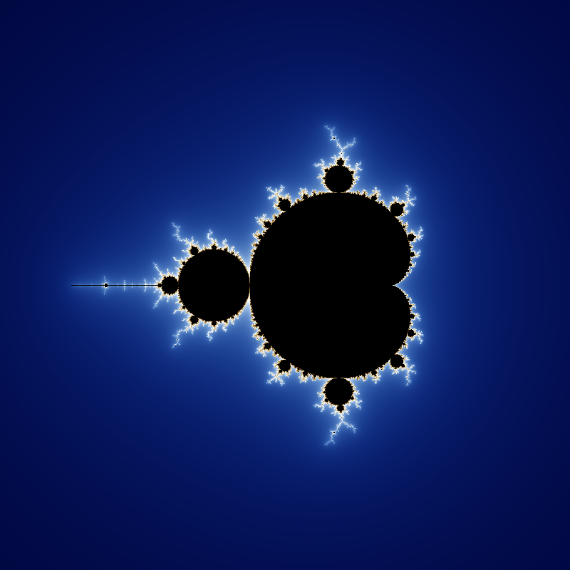
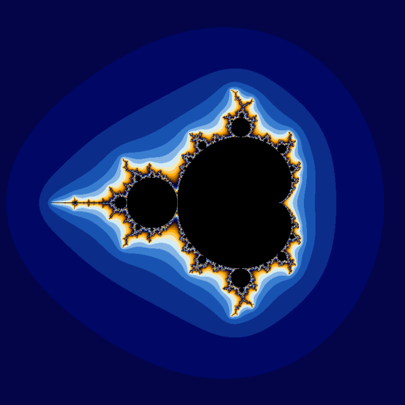
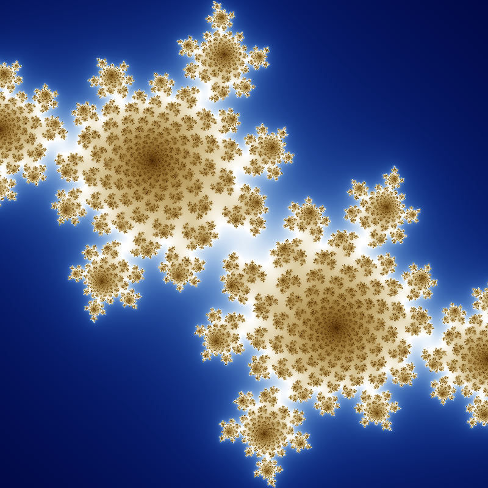
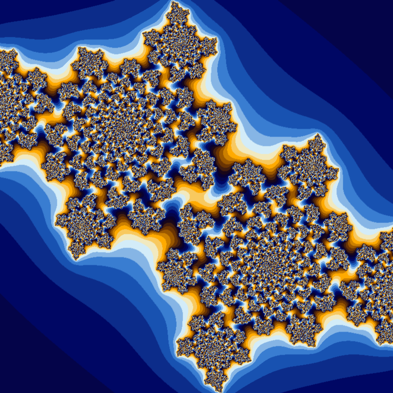

# Fractals-Generator

My main goal for the project was to somehow generate the fractal colouring scheme similar to the Mandelbrot picture on wikipedia:

I was able to generate two colouring schemes and following are pictures of both Mandelbrot set and the Julia set plotted using those two approaches:
Smooth Colour Scheme          |  Gradient Colour Scheme
:-------------------------:|:-------------------------:
  |  
  |  
