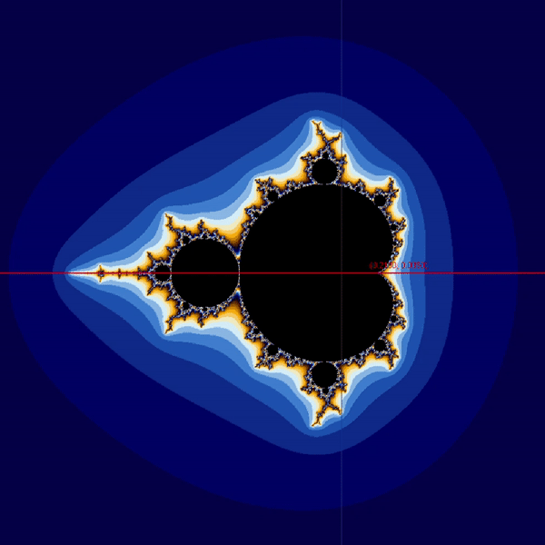

# Introduction

My main goal for the project was to somehow generate the fractal colouring scheme similar to the Mandelbrot picture on wikipedia:


I was able to generate two colouring schemes and following are pictures of both Mandelbrot set and the Julia set plotted using those two approaches:
Smooth Colour Scheme          |  Gradient Colour Scheme
:-------------------------:|:-------------------------:
  |  
  |  

The program can also display the real and imaginary axes on the plot. The complex number corresponding to the mouse pointer location is displayed under the mouse pointer. The following is a screenshot of the program showing the axes and the position:\


# Usage

```
java Fractal Mandelbrot [REALMIN REALMAX IMAGMIN IMAGMAX] [MAXITR]
OR
java Fractal Julia [C_REAL C_IMAG] [MAXITR]
```

The first argument must be the type of the fractal (either the Mandelbrot set or the Filled Julia set) to be drawn and is required.\
If the first argument provided is Mandelbrot, the following arguments REALMIN, REALMAX, IMAGMIN, IMAGMAX which specifies the Region Of Interest and MAXITR which specifies the maximum number of iterations are optional.\
If not provided the default values of the Region Of Interest are -1, 1, -1, 1 and the default value of MAXITR is 1000.\
If the first argument provided is Julia, the following arguments C_REAL C_IMAG which specifies the real and imaginary values of the constant complex number and MAXITR are optional.\
If not provided the default values of the C_REAL C_IMAG are -0.4, 0.6 and the default value of MAXITR is 1000.
